<div align="center">

# 🚀 Flask K8s CI/CD Pipeline

**An end-to-end, production-style DevOps pipeline: a Flask application containerized with Docker, deployed to Kubernetes, automated with GitHub Actions, and observed with Prometheus & Grafana — all provisioned on a hardened AWS EC2 instance.**

<p>
  
  
  
  
  
  
  
  
  
</p>

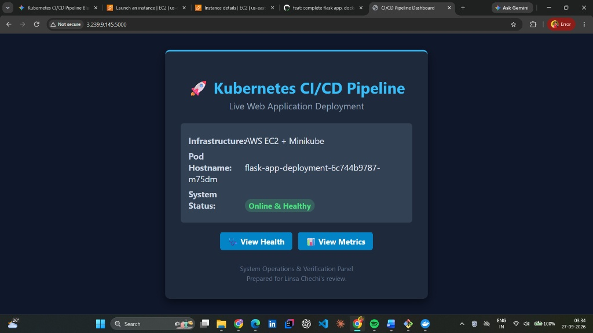

</div>

---

## 📑 Table of Contents

- [Overview](#-overview)
- [Skills Demonstrated](#-skills-demonstrated)
- [Architecture](#️-architecture)
- [Tech Stack](#-tech-stack)
- [Project Structure](#-project-structure)
- [AWS EC2 Provisioning](#️-aws-ec2-provisioning)
- [Infrastructure Setup](#️-infrastructure-setup-aws-ec2)
- [The Application](#️-the-application)
- [Containerization](#-containerization)
- [Kubernetes Manifests](#️-kubernetes-manifests)
- [CI/CD Pipeline](#-cicd-pipeline-github-actions)
- [Monitoring & Observability](#-monitoring--observability-prometheus--grafana)
- [Pipeline in Action](#-pipeline-in-action)
- [How to Reproduce](#️-how-to-reproduce)
- [Challenges & Solutions](#-challenges--solutions)
- [Future Improvements](#-future-improvements)
- [Connect](#-connect)

---

## 📖 Overview

This project simulates a real-world platform engineering workflow, taken from a blank AWS account to a fully automated, observable deployment pipeline:

1. A **Flask** application exposing a status dashboard and a **Prometheus**-instrumented `/metrics` endpoint.
2. Packaged into a **Docker** image and published to **Docker Hub**.
3. Deployed onto a **Kubernetes** cluster (**Minikube**) running on a purpose-provisioned **AWS EC2** instance.
4. Every `git push` to `main` triggers a **GitHub Actions** pipeline that builds the image, pushes it to the registry, and rolls out the update on the cluster — with zero manual intervention.
5. A **kube-prometheus-stack** (Prometheus + Grafana, installed via **Helm**) scrapes the app through a **ServiceMonitor** and visualizes live traffic in real time.

```
Developer → git push → GitHub Actions → Docker Hub → SSH to EC2 → kubectl apply/rollout
          → Live on Minikube → Scraped by Prometheus → Visualized in Grafana
```

---

## 🎯 Skills Demonstrated

| Category | Demonstrated by |
|---|---|
| **CI/CD Pipeline Design** | Multi-stage GitHub Actions workflow (build → push → deploy), triggered on every commit |
| **Containerization** | Writing an optimized, layer-cached `Dockerfile`; image build & registry publishing |
| **Container Orchestration** | Authoring Kubernetes `Deployment` and `Service` manifests with replica counts and resource limits |
| **Cloud Infrastructure (AWS)** | Provisioning and hardening an EC2 instance — custom security group rules scoped per service, not blanket-open |
| **Secrets Management** | Managing sensitive credentials (registry, SSH keys) via GitHub Actions encrypted secrets |
| **Observability / Monitoring** | Deploying `kube-prometheus-stack` via Helm; writing a `ServiceMonitor` CRD; querying live metrics in Grafana |
| **Linux & Remote Systems Administration** | Bootstrapping a headless Ubuntu server: Docker, `kubectl`, Minikube, Helm, via SSH |
| **Version Control & Git Workflow** | Structured commit history, `main`-based CI trigger, conventional commit messages |
| **Troubleshooting** | Diagnosing and resolving a NodePort → named-port mismatch to enable Prometheus service discovery (see [Challenges & Solutions](#-challenges--solutions)) |

---

## 🏗️ Architecture

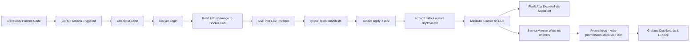
```mermaid
flowchart LR
    A[Developer Pushes Code] --> B[GitHub Actions Triggered]
    B --> C[Checkout Code]
    C --> D[Docker Login]
    D --> E[Build & Push Image to Docker Hub]
    E --> F[SSH into EC2 Instance]
    F --> G[git pull latest manifests]
    G --> H[kubectl apply -f k8s/]
    H --> I[kubectl rollout restart deployment]
    I --> J[Minikube Cluster on EC2]
    J --> K[Flask App Exposed via NodePort]
    J --> L[ServiceMonitor Watches /metrics]
    L --> M[Prometheus - kube-prometheus-stack via Helm]
    M --> N[Grafana Dashboards & Explore]
```

---

## 🧰 Tech Stack

| Layer               | Technology                                                   |
|---------------------|---------------------------------------------------------------|
| Application         | Python, Flask, `prometheus-client`                            |
| Containerization    | Docker                                                         |
| Registry            | Docker Hub                                                     |
| Orchestration       | Kubernetes (Minikube)                                          |
| Compute             | AWS EC2 — Ubuntu 24.04, `t3.micro` / `t2.medium`, 20 GiB gp3   |
| CI/CD               | GitHub Actions                                                 |
| Deployment Access   | SSH (`appleboy/ssh-action`)                                    |
| Secrets Management  | GitHub Actions Encrypted Secrets                               |
| Monitoring          | Prometheus + Grafana (`kube-prometheus-stack`)                 |
| Package Manager     | Helm                                                            |

---

## 📁 Project Structure

```
flask-k8s-cicd/
├── .github/
│   └── workflows/
│       └── ci-cd.yml          # GitHub Actions pipeline
├── k8s/
│   ├── deployment.yaml        # Kubernetes Deployment (2 replicas, resource limits)
│   ├── service.yaml           # Kubernetes Service (NodePort, named "http" port, 5000 → 30005)
│   └── servicemonitor.yaml    # Prometheus Operator ServiceMonitor (scrapes /metrics every 15s)
├── app.py                     # Flask app + Prometheus /metrics + dashboard UI
├── requirements.txt           # flask, prometheus-client
├── Dockerfile                 # Python 3.11-slim based image
└── .dockerignore
```

---

## ☁️ AWS EC2 Provisioning

Before any software goes on the box, the EC2 instance is launched deliberately — right-sized and access-controlled from the start.

**Instance name & AMI** — `soham-server` on **Ubuntu 24.04 (Canonical)**:

<p align="center">
  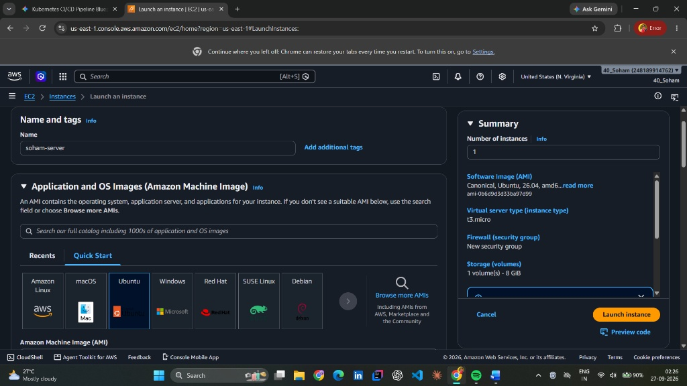
</p>

**Inbound security group rules** — opened deliberately per service, not blanket-open:

| Port | Protocol | Purpose | Source |
|------|----------|---------|--------|
| `22`   | SSH  | Remote/CI access to the box | Anywhere |
| `80`   | HTTP | General web access | Anywhere |
| `3000` | Custom TCP | Grafana UI | Anywhere |
| `5000` | Custom TCP | Flask app (NodePort target) | Restricted to **My IP** |
| `9090` | Custom TCP | Prometheus UI | Anywhere |

<p align="center">
  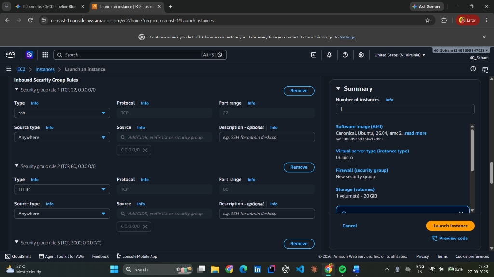
</p>

<p align="center">
  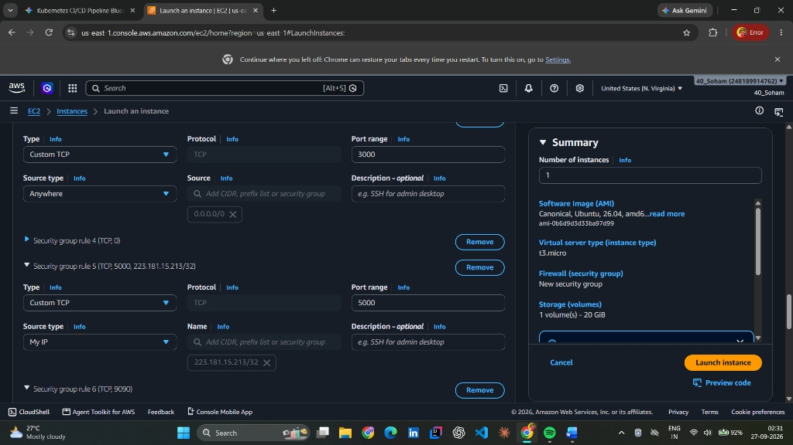
</p>

<p align="center">
  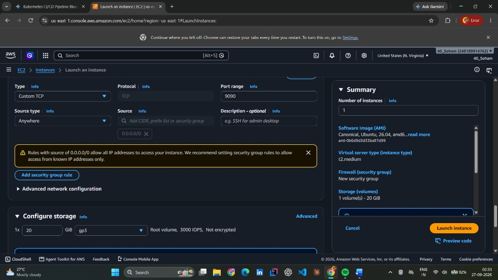
</p>

**Storage** — a single `20 GiB` `gp3` root volume, enough headroom for Docker images, Minikube, and the monitoring stack.

---

## 🖥️ Infrastructure Setup (AWS EC2)

The EC2 instance is provisioned with Docker, `kubectl`, Minikube, and Helm to act as the deployment target:

<p align="center">
  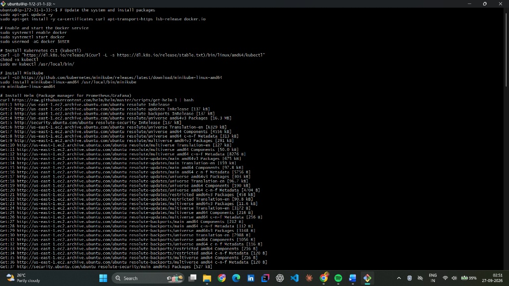
</p>

<p align="center">
  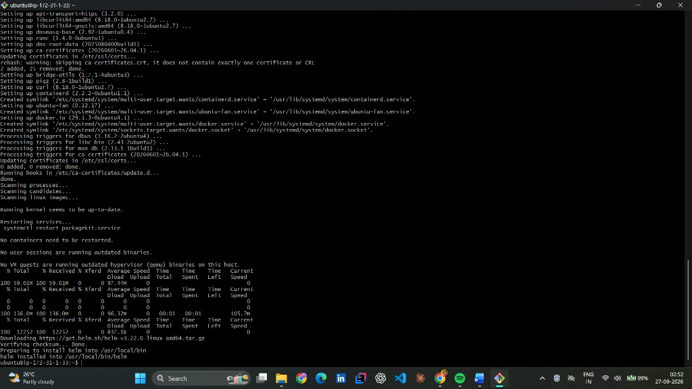
</p>

Once installed, Minikube is started with the Docker driver and verified with `kubectl get nodes`:

<p align="center">
  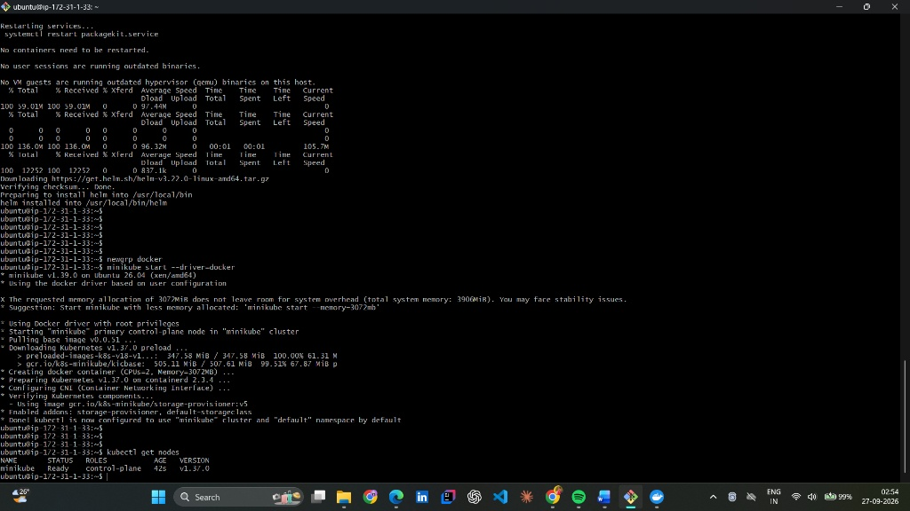
</p>

---

## ⚙️ The Application

A lightweight Flask app that serves a styled dashboard and exposes a custom Prometheus counter (`request_count_total`) tracking total HTTP requests per endpoint.

<p align="center">
  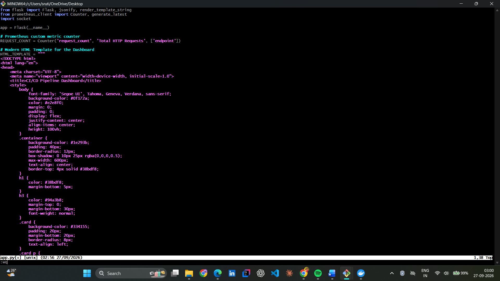
</p>

**`requirements.txt`**

<p align="center">
  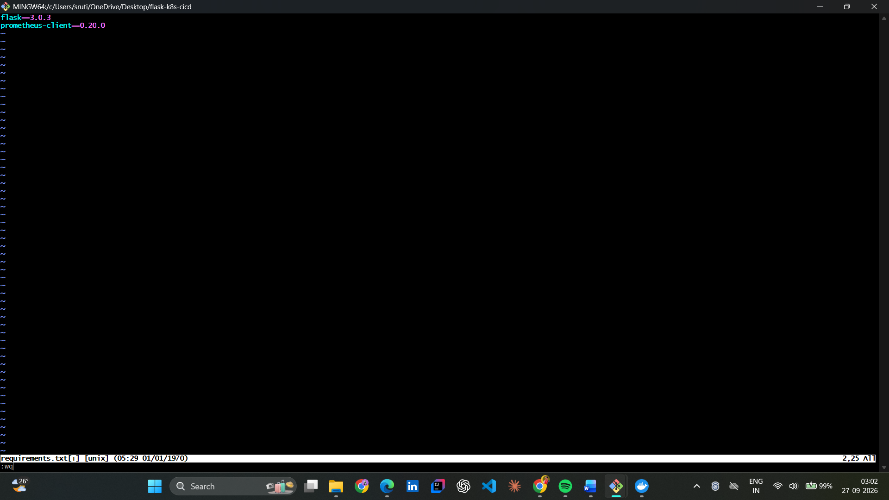
</p>

---

## 🐳 Containerization

A minimal, layer-cached `Dockerfile` built on `python:3.11-slim`:

<p align="center">
  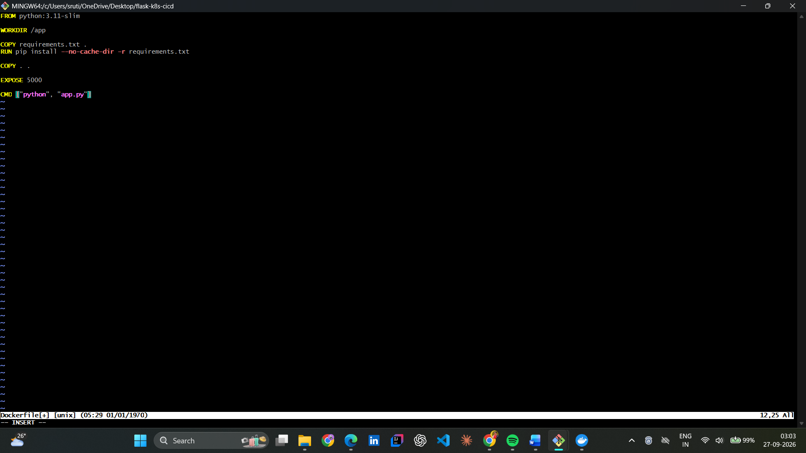
</p>

```dockerfile
FROM python:3.11-slim
WORKDIR /app
COPY requirements.txt .
RUN pip install --no-cache-dir -r requirements.txt
COPY . .
EXPOSE 5000
CMD ["python", "app.py"]
```

**Verified on Docker Hub** — `sohamdocker25/flask-k8s-app:latest`, pushed automatically by the pipeline on every commit:

<p align="center">
  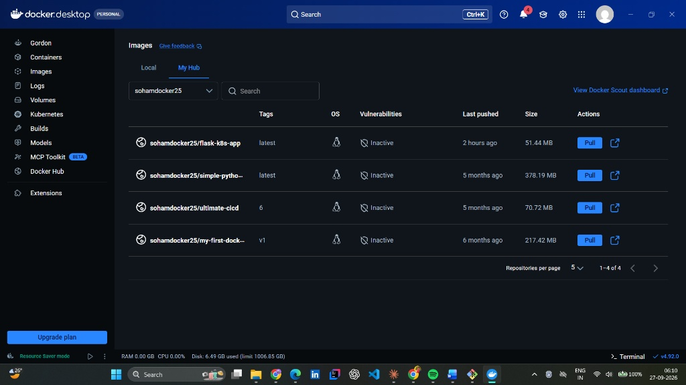
</p>

---

## ☸️ Kubernetes Manifests

**Deployment** — 2 replicas with defined CPU/memory requests & limits:

<p align="center">
  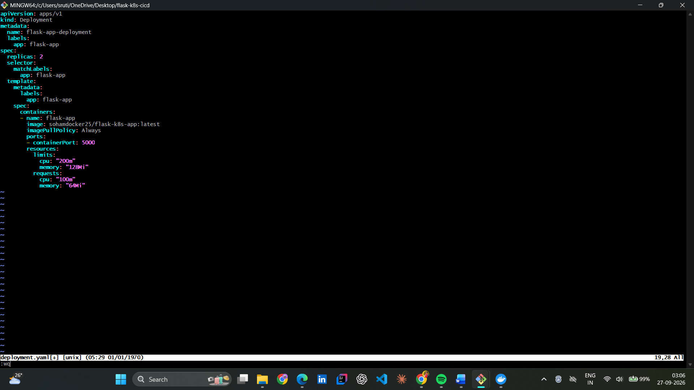
</p>

**Service** — `NodePort` exposing the app on port `30005`. The port was given the name `http` so the Prometheus `ServiceMonitor` can target it by name:

<p align="center">
  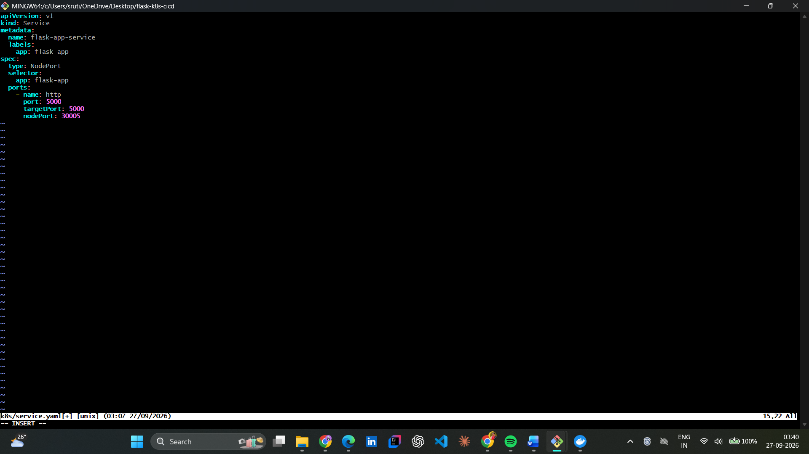
</p>

**ServiceMonitor** — tells the Prometheus Operator to scrape `/metrics` on the `http` port every 15 seconds:

<p align="center">
  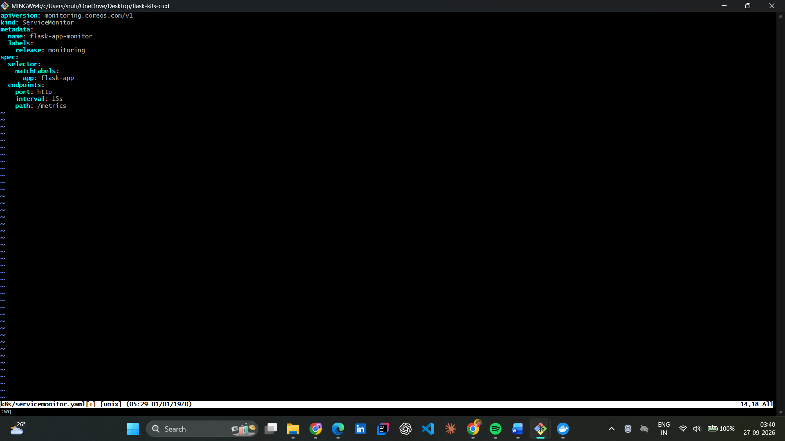
</p>

```yaml
apiVersion: monitoring.coreos.com/v1
kind: ServiceMonitor
metadata:
  name: flask-app-monitor
  labels:
    release: monitoring
spec:
  selector:
    matchLabels:
      app: flask-app
  endpoints:
    - port: http
      interval: 15s
      path: /metrics
```

---

## 🔁 CI/CD Pipeline (GitHub Actions)

The workflow at `.github/workflows/ci-cd.yml` runs on every push to `main`:

<p align="center">
  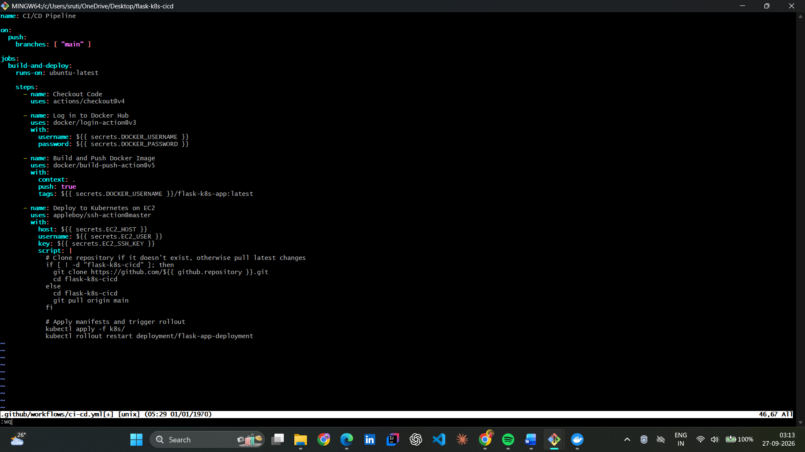
</p>

**Pipeline stages:**

| Step | Action |
|------|--------|
| 1️⃣ Checkout Code | `actions/checkout@v4` |
| 2️⃣ Docker Login | `docker/login-action@v3` using repo secrets |
| 3️⃣ Build & Push Image | `docker/build-push-action@v5` → Docker Hub |
| 4️⃣ Deploy to EC2 | `appleboy/ssh-action` clones/pulls repo, runs `kubectl apply` + `kubectl rollout restart` |

**Secrets used** (configured under repo **Settings → Secrets and variables → Actions**):

- `DOCKER_USERNAME`
- `DOCKER_PASSWORD`
- `EC2_HOST`
- `EC2_USER`
- `EC2_SSH_KEY`

<p align="center">
  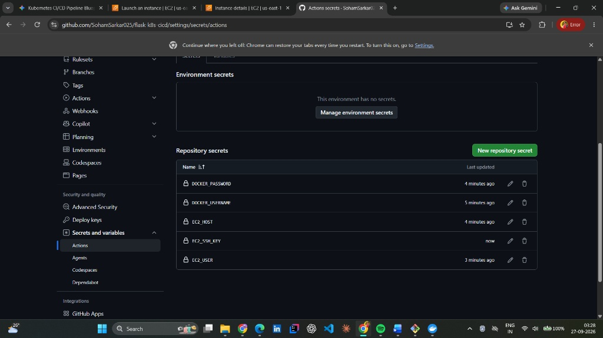
</p>

The pipeline re-triggers automatically on every subsequent push — here it ran a second time for the `configure prometheus service monitor` commit:

<p align="center">
  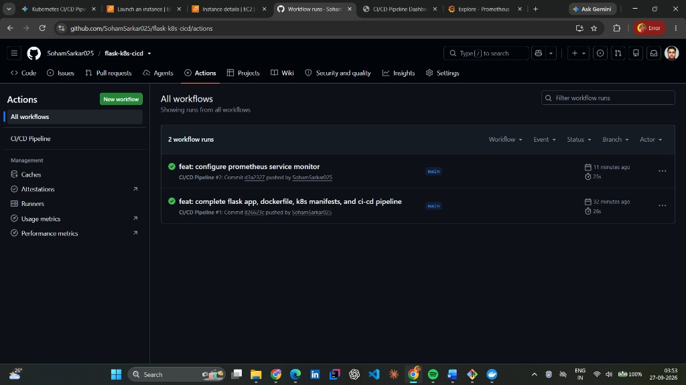
</p>

---

## 📊 Monitoring & Observability (Prometheus + Grafana)

The app exposes a `/metrics` endpoint tracking a custom `request_count_total` counter labeled by endpoint. On top of the cluster, the **`kube-prometheus-stack`** Helm chart (Prometheus, Grafana, and the Prometheus Operator) is installed to scrape and visualize it.

**1. Install the monitoring stack via Helm** on the EC2/Minikube host:

<p align="center">
  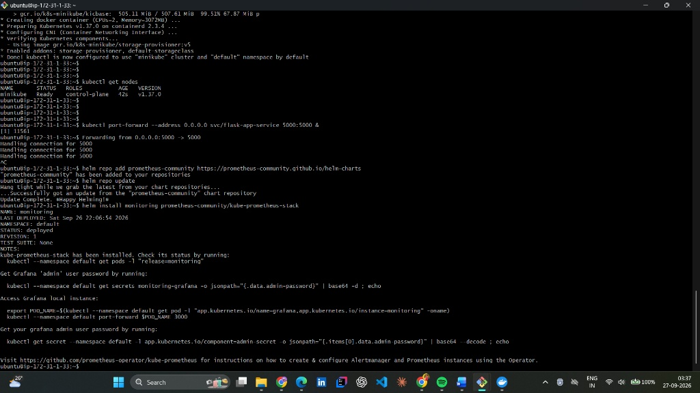
</p>

```bash
helm repo add prometheus-community https://prometheus-community.github.io/helm-charts
helm repo update
helm install monitoring prometheus-community/kube-prometheus-stack
```

**2. Commit and push the `ServiceMonitor`** so Prometheus starts discovering the Flask service:

<p align="center">
  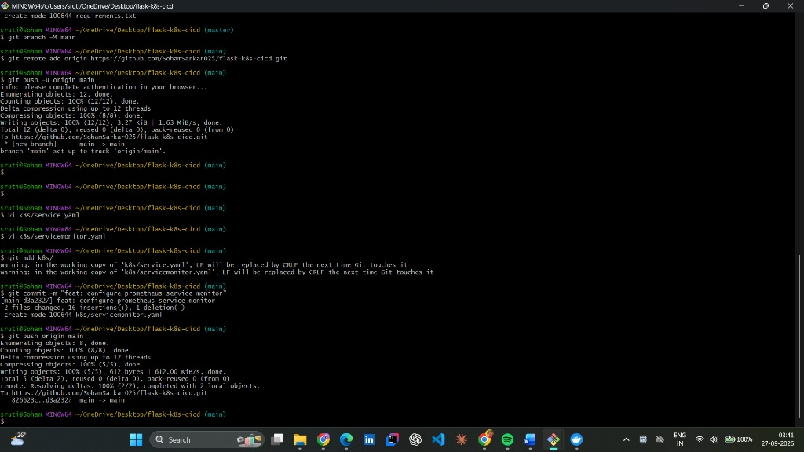
</p>

**3. Port-forward Prometheus and Grafana** alongside the app itself:

<p align="center">
  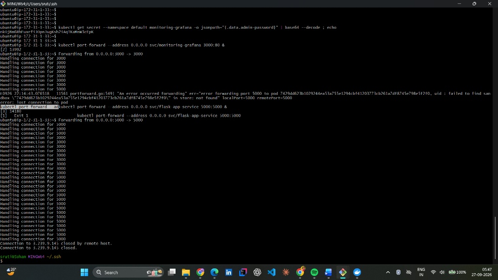
</p>

```bash
kubectl port-forward --address 0.0.0.0 svc/monitoring-grafana 3000:80 &
kubectl port-forward --address 0.0.0.0 svc/flask-app-service 5000:5000 &
```

**4. Open Grafana** and log in with the admin password retrieved via `kubectl get secret`:

<p align="center">
  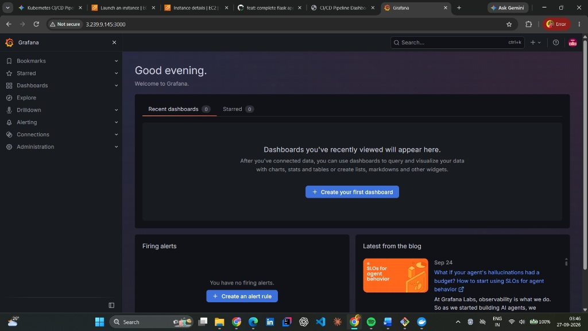
</p>

**5. Query live metrics** — `request_count_total` spiking in **Explore** as traffic hits the Flask app:

<p align="center">
  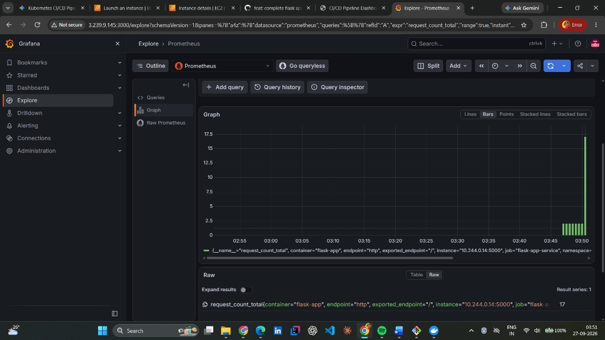
</p>

---

## ✅ Pipeline in Action

A successful end-to-end run — build, push, and deploy completed in ~26 seconds:

<p align="center">
  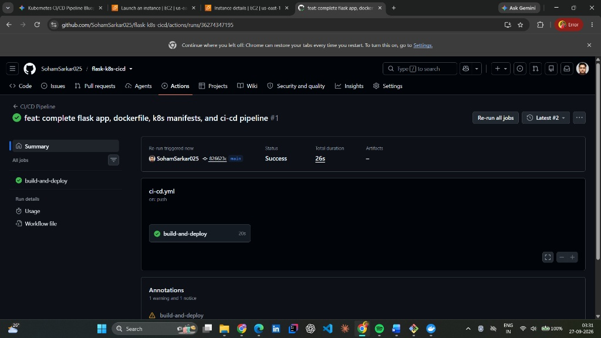
</p>

Exposing the deployed service for access outside the cluster via `kubectl port-forward`:

<p align="center">
  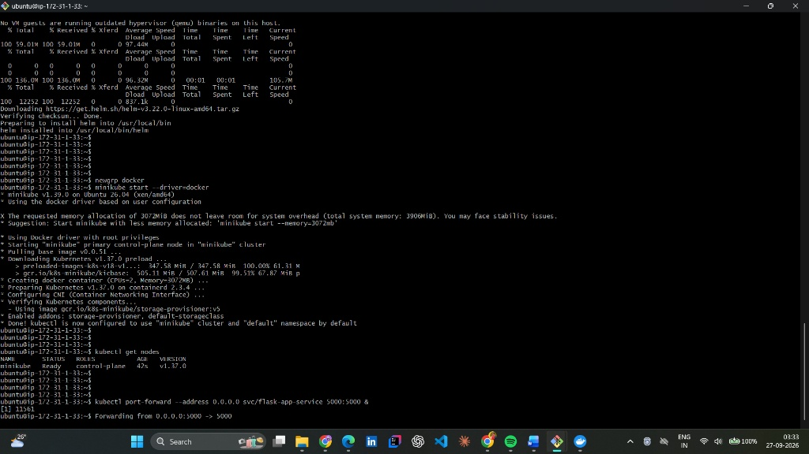
</p>

Local scaffolding of the project before the first push:

<p align="center">
  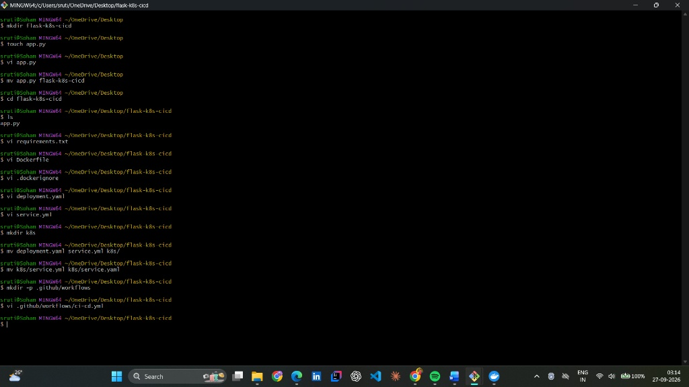
</p>

<p align="center">
  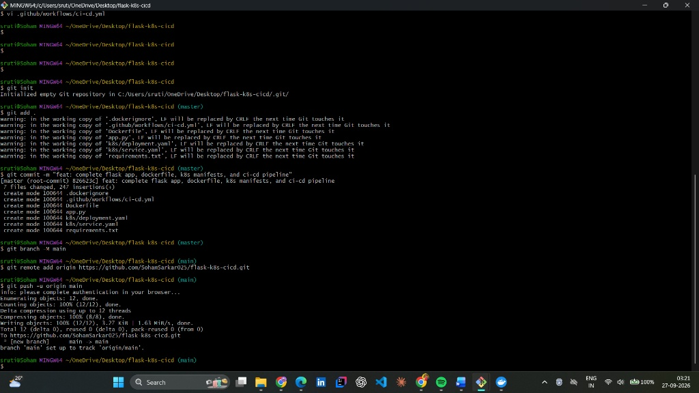
</p>

---

## 🛠️ How to Reproduce

**1. Clone and run the app locally**
```bash
git clone https://github.com/SohamSarkar025/flask-k8s-cicd.git
cd flask-k8s-cicd
pip install -r requirements.txt
python app.py
```

**2. Build and run with Docker**
```bash
docker build -t <your-dockerhub-username>/flask-k8s-app:latest .
docker run -p 5000:5000 <your-dockerhub-username>/flask-k8s-app:latest
```

**3. Deploy to Kubernetes**
```bash
kubectl apply -f k8s/deployment.yaml
kubectl apply -f k8s/service.yaml
kubectl get pods
kubectl port-forward --address 0.0.0.0 svc/flask-app-service 5000:5000
```

**4. Add the monitoring stack**
```bash
helm repo add prometheus-community https://prometheus-community.github.io/helm-charts
helm repo update
helm install monitoring prometheus-community/kube-prometheus-stack
kubectl apply -f k8s/servicemonitor.yaml
```

**5. Set up CI/CD**
- Fork/clone this repo
- Add `DOCKER_USERNAME`, `DOCKER_PASSWORD`, `EC2_HOST`, `EC2_USER`, `EC2_SSH_KEY` under **Settings → Secrets and variables → Actions**
- Push to `main` — GitHub Actions handles the rest

---

## 🧩 Challenges & Solutions

| Challenge | Solution |
|---|---|
| Prometheus wasn't discovering the Flask service via the `ServiceMonitor` | The `Service`'s port needed an explicit **name** (`http`) matching the `ServiceMonitor`'s `port` field — an unnamed port isn't addressable by the Operator's selector logic. |
| Exposing multiple services (Flask, Grafana) from a single EC2 box without a load balancer | Used `kubectl port-forward --address 0.0.0.0` bound to distinct ports (`5000`, `3000`), combined with per-port security group rules instead of opening the whole instance. |
| Keeping SSH/registry credentials out of the codebase | Moved all sensitive values into GitHub Actions encrypted secrets, referenced only via `${{ secrets.* }}` in the workflow — nothing sensitive is committed. |
| Minimizing attack surface on a public-facing EC2 instance | Scoped the Flask app's port to **My IP only** in the security group, rather than leaving it open to `0.0.0.0/0` like the rest. |

---

## 🌱 Future Improvements

- [x] Integrate Prometheus + Grafana stack via Helm on the same cluster
- [ ] Add a persistent, provisioned Grafana dashboard (instead of ad-hoc Explore queries)
- [ ] Package the app itself as a Helm chart for templated deployments
- [ ] Add automated testing stage before build in the pipeline
- [ ] Move from NodePort to Ingress for cleaner external access
- [ ] Add staging vs production environments with GitHub Actions environments
- [ ] Add Alertmanager rules for request-rate/error alerts
- [ ] Migrate infrastructure provisioning to Terraform for full IaC coverage

---

## 🔗 Connect

Built by **Soham Sarkar** — final-year Computer Science graduate transitioning into DevOps / Cloud Engineering — as part of the [`#100DaysOfDevOps`](https://github.com/SohamSarkar025/100DaysOfDevOps) challenge.

- 💻 GitHub: [@SohamSarkar025](https://github.com/SohamSarkar025)
- 💼 LinkedIn: [linkedin.com/in/sohamsarkar000](https://www.linkedin.com/in/sohamsarkar000)
- 📧 Open to DevOps Engineer / Cloud Engineer / SRE roles

---

<div align="center">

⭐ **If you found this project useful, consider giving it a star!**

</div>

